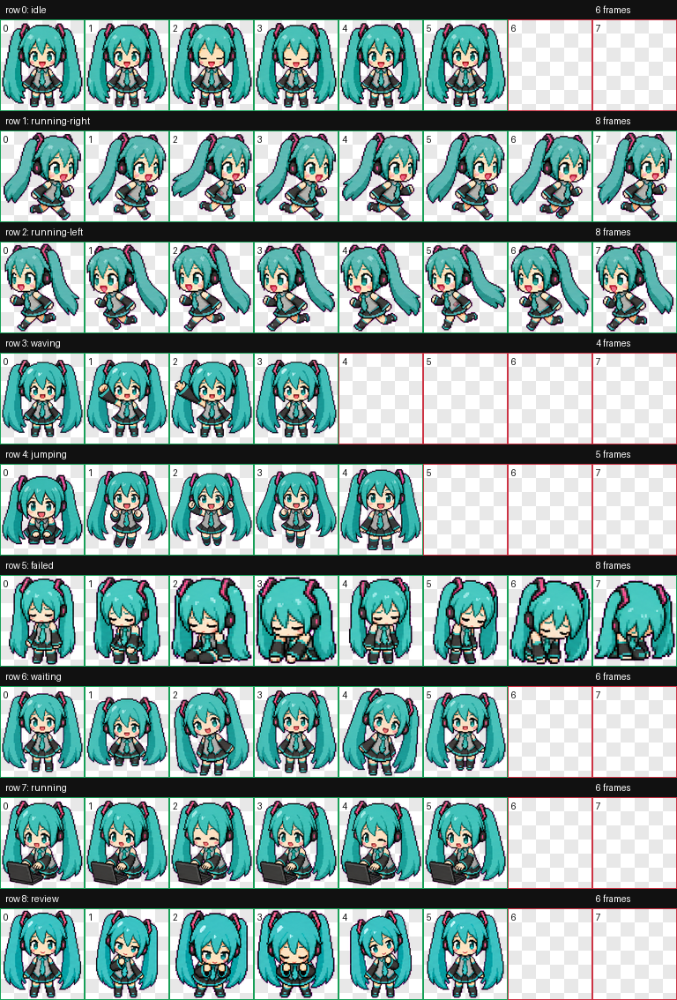

# Codex Miku Pet

一个适用于 Codex 自定义桌面宠物的 Hatsune Miku 风格像素宠物资源包。

仓库地址：`git@github.com:bjfqdclf/codex-miku.git`



## 内容

这个仓库包含可直接安装的宠物包，以及生成过程中的验证和预览产物。

```text
package/
  pet.json
  spritesheet.webp
run/
  final/
    validation.json
    spritesheet.webp
  qa/
    contact-sheet.png
    videos/
```

- `package/pet.json`：Codex 宠物元信息，包含 `id`、展示名称、描述和精灵图路径。
- `package/spritesheet.webp`：可直接使用的透明背景动画精灵图。
- `run/qa/contact-sheet.png`：所有动作帧的总览图，适合在 GitHub 页面快速预览。
- `run/qa/videos/`：各动作的本地预览视频。
- `run/final/validation.json`：精灵图验证结果。

## 安装

克隆仓库：

```bash
git clone git@github.com:bjfqdclf/codex-miku.git
cd codex-miku
```

安装到 Codex pets 目录：

```bash
mkdir -p "${CODEX_HOME:-$HOME/.codex}/pets/hatsune-miku"
cp package/pet.json package/spritesheet.webp "${CODEX_HOME:-$HOME/.codex}/pets/hatsune-miku/"
```

安装完成后的目录应为：

```text
${CODEX_HOME:-$HOME/.codex}/pets/hatsune-miku/
  pet.json
  spritesheet.webp
```

然后在支持自定义宠物的 Codex 环境中选择或加载 `hatsune-miku`。

## 宠物信息

| 字段 | 值 |
| --- | --- |
| Pet ID | `hatsune-miku` |
| Display Name | `Hatsune Miku` |
| Spritesheet | `1536x1872` WEBP RGBA |
| Layout | `8x9` atlas |
| Validation | `run/final/validation.json` 中 `ok` 为 `true` |

## 说明

这是一个非官方的自定义 Codex 宠物资源包。角色造型灵感来自 Hatsune Miku，仅用于个人桌面宠物展示和本地 Codex 自定义体验。
